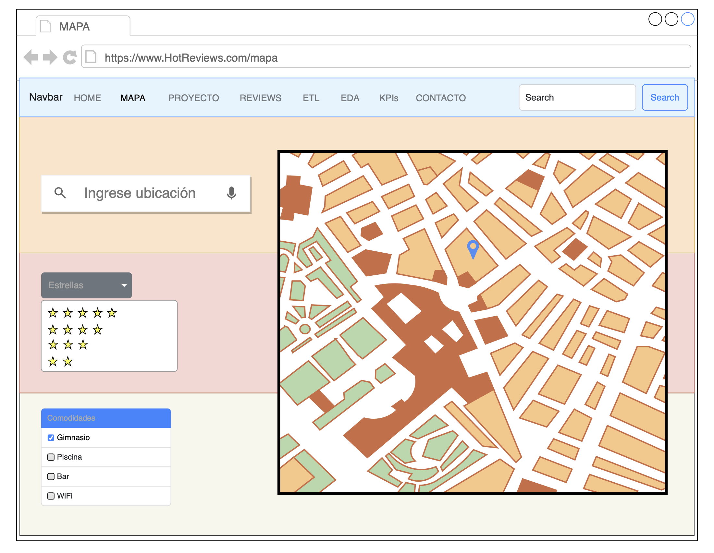

# Página web de HotReviews

## Descripción del proyecto

La página web de HotReviews es una plataforma diseñada para compartir y encontrar reseñas de hoteles. Permite a los usuarios buscar reseñas de hoteles por ubicación, clasificación y otros criterios, así como publicar sus propias reseñas y opiniones.

## Instalación

Asegúrate de tener Python instalado. Recomiendo usar un entorno virtual para instalar las dependencias del proyecto.

1. Clona este repositorio en tu máquina local.
2. Crea un entorno virtual para trabajar 
3. Instala las dependencias necesarias utilizando el gestor de paquetes de tu elección (por ejemplo, npm o pip).

### Procedimiento

```bash
git clone https://github.com/mdallanegra/LAB_PG.git

python3 -m venv myenv
source myenv/bin/activate

pip install -r requirements.txt
```

## Uso

1. Dirigete el directorio principal ```/HotReviews```
2. Ejecuta la aplicación utilizando el comando `npm start` o `python manage.py runserver`.
3. Abre tu navegador web y navega a la URL proporcionada para acceder a la página web de HotReviews.
4. Explora las diferentes funcionalidades de la página web, como búsqueda de reseñas, publicaciones, etc.

## Frameworks de Trabajo

Este proyecto utiliza los siguientes frameworks de trabajo:

- ```Django```: Framework de desarrollo web de alto nivel en Python que fomenta el desarrollo rápido y limpio.
- ```Bootstrap```: Framework que facilita la creación de interfaces de usuario responsivas y modernas para sitios y aplicaciones web.
- ```Visual Studio Code```: Editor de código fuente desarrollado por Microsoft para Windows, Linux y macOS.

## Lenguajes de Programación

Este proyecto utiliza los siguientes lenguajes de programación:

- ```Python```
- ```HTML```
- ```CSS```
- ```JavaScript```

## Ejemplos

- Mockup de pantalla de la página de inicio:

<p align="center">
    
</p>

- Mockup de pantalla de la búsqueda de reseñas:
<p align="center">
    
</p>

## Contribución

¡Estamos abiertos a contribuciones! Si tienes ideas de mejora, problemas que reportar o características nuevas que te gustaría añadir, no dudes en abrir una solicitud de extracción o un problema en este repositorio.

## Créditos

- Desarrollado por (Equipo).
- Logotipo diseñado por (Diseñador).

## Licencia

Este proyecto está bajo las Licencias:

- [Licencia GPL 3.0](LICENSE-GPL).
- [Licencia MIT](LICENSE-MIT).
- [Licencia Apache 2.0](LICENSE-APACHE).

## Contacto

Si tienes alguna pregunta, comentario o problema con la página web de HotReviews, no dudes en ponerte en contacto con nosotros en [mdallanegra@icloud.com](mailto:mdallanegra@icloud.com).

## Enlaces adicionales

- [Documentación completa del proyecto](/HotReviews)
- [Repositorio de código fuente](https://github.com/mdallanegra/LAB_PG.git)
- [Sitio web en vivo](https://www.soyhenry.com)
